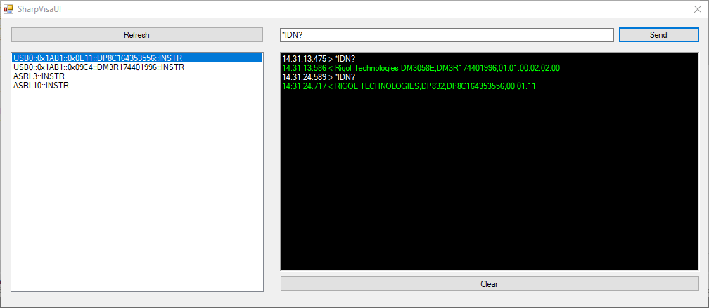

# SharpVisa

Very basic VISA CLI and tryout UI. 

Tested against NIVISA1700full.

## TODO

* Opening and unexisting Rigol DM3058E requires a Windows restart for it to work again. Reinstalling the driver works too. All other available Rigol instruments (DP832, DG1022A, DS1102E) work ok.
